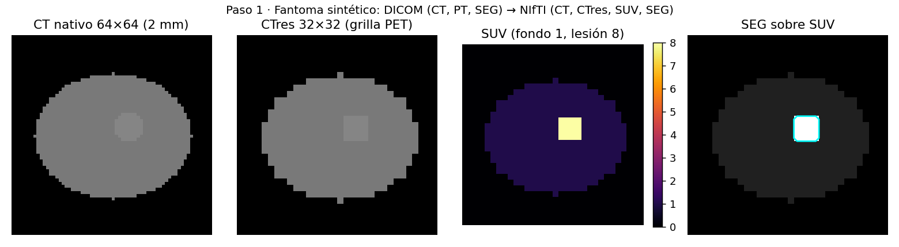

# Bitácora del proyecto

Registro cronológico de lo que se hizo, por qué, qué se decidió y qué quedó pendiente.
Es la evidencia de "trabajo sistemático" que pide la rúbrica y la fuente para la sección
"Riesgos y ajustes al plan" de la entrega parcial. Cada entrada lleva fecha, paso y commit.

Convención de pasos (escalera de objetivos de la definición de tema):

| Paso | Objetivo | Estado |
|---|---|---|
| 0 | Repositorio, entorno, bitácora, glosario | hecho (03-09-2026) |
| 1 | Datos: subconjunto reproducible, descarga TCIA, DICOM → NIfTI con SUV | código listo y probado; descarga real pendiente |
| 2 | Preprocesamiento (3 mm, ventaneo, recorte, parches) + referencia clásica (OE1) | pendiente |
| 3 | Modelo A, fusión temprana (OE2), en Colab | pendiente |
| 4 | Modelos B y C, fusión intermedia (OE3) | pendiente |
| 5 | Evaluación comparativa y análisis por órgano (OE4) | pendiente |

Puertas de decisión: **S2** pipeline de punta a punta con 20 estudios reales · **S5** modelo A
entrenando con Dice creciente · **S8** bloque de fusión intermedia funcionando.

---

## 2026-09-03. Paso 0 y Paso 1 (código)

**Qué se hizo**

- Se creó la estructura del repositorio (`src/petct`, `scripts`, `tests`, `configs`, `docs`, `report`, `data/manifests`) y la configuración central `configs/default.yaml` con todos los números del proyecto (semilla 423, 200 positivos + 50 negativos, partición 70/10/20 por paciente, 3 mm, ventana −200/300 HU, parches 96³).
- `src/petct/suv.py`: cálculo del SUVbw desde las etiquetas DICOM (dosis, semivida, hora de inyección y de adquisición, peso), con corrección de decaimiento y manejo del cruce de medianoche. Sigue la convención de autoPET (Units BQML, DecayCorrection START).
- `src/petct/convert.py`: lectura de series DICOM con SimpleITK, conversión a NIfTI, CT remuestreado a la grilla del PET (CTres) y conversión del DICOM SEG a máscara binaria ubicando cada frame por su posición física (no por su índice).
- `src/petct/tcia.py` y `scripts/01`–`03`: selección estratificada y reproducible del subconjunto a partir del CSV clínico de TCIA, consulta y descarga de series con `tcia_utils`, y conversión por estudio.
- `tests/`: fantoma DICOM sintético (CT 64×64 a 2 mm, PET 32×32 a 4 mm, lesión esférica de SUV 8 sobre fondo 1, SEG con frames en orden invertido a propósito). **8 pruebas pasan**: aritmética del SUV, cruce de medianoche, lectura de parámetros desde DICOM, archivos generados, SUV en lesión y fondo, CTres en la grilla del PET, SEG con Dice > 0,999 contra la verdad.

**Decisiones**

- Se usa **SimpleITK** para leer las series (ordena cortes y aplica RescaleSlope/Intercept) en lugar de `dicom2nifti`, para tener control total de la geometría y menos dependencias.
- El DICOM SEG se convierte con código propio (posición física de cada frame) en vez de `pydicom-seg`, que está sin mantención.
- La partición es **por paciente** y se fija con semilla: un paciente nunca aparece en dos particiones.
- Los datos y modelos quedan fuera del repositorio; solo se versionan manifiestos y código.

**Verificado / no verificado**

- Verificado: la conversión completa funciona en el fantoma sintético; el factor SUV coincide con el cálculo a mano.
- No verificado aún: el CSV clínico real de TCIA (nombres exactos de columnas; el script detecta variantes), la descarga con `tcia_utils` y un DICOM SEG real de autoPET. La API de TCIA está bloqueada desde el entorno de desarrollo remoto, así que la descarga se prueba en el computador personal.

**Pendiente inmediato (Paso 1, parte real)**

1. Descargar el CSV clínico desde TCIA a `data/manifests/clinical_tcia.csv`.
2. `pip install tcia_utils` y correr `scripts/01` y `scripts/02 --limit 3`.
3. Convertir esos 3 estudios con `scripts/03` y mirar SUV, CTres y SEG en un visor (3D Slicer o ITK-SNAP). Registrar en esta bitácora qué se vio y cualquier ajuste.
4. Subir el repositorio a GitHub (primer commit).

## 2026-09-03 (tarde). Cuadernos, entorno y dónde corre cada cosa

**Qué se hizo**

- Se agregaron dos cuadernos comentados en `notebooks/`, pensados para VS Code en el Mac: `00_entorno.ipynb` (versiones, dispositivo que ve PyTorch, RAM y disco; su salida se pega aquí) y `01_datos_suv_conversion.ipynb` (todo el Paso 1 explicado celda a celda: SUV a mano, fantoma sintético, lectura de metadatos, conversión, verificación visual y numérica, y una sección que solo corre cuando hay estudios reales en `data/raw`). Los cuadernos se generan desde `notebooks/build_notebooks.py`, así quedan versionados como texto y se pueden regenerar sin editarlos a mano.
- `src/petct/device.py`: elige `cuda` (Colab), `mps` (chip gráfico de Apple) o `cpu`, e imprime una descripción para la bitácora.
- Se quitaron los guiones largos de los textos y se revisó el tono de los comentarios para que se lean como notas de trabajo y no como texto generado.

**Decisión: Mac o Colab**

Los pasos 1, 2 y 5 corren en el Mac (lectura DICOM, SUV, remuestreo, referencia clásica, métricas). Los entrenamientos con presupuesto completo (pasos 3 y 4, unas 25 000 iteraciones por modelo) corren en Colab, que tiene CUDA y una GPU dedicada. En el Mac, PyTorch usa `mps` para probar que el código funciona con parches chicos y para entrenamientos cortos; si `00_entorno` muestra 32 GB o más de memoria unificada y una prueba de 500 iteraciones rinde razonablemente, se puede correr un modelo completo de noche en el Mac y dejar Colab para los otros dos. La decisión final se toma con los tiempos medidos, no antes.

**Pendiente**

- Correr `00_entorno.ipynb` en el Mac y pegar la salida aquí.
- Paso 1 con datos reales (CSV clínico, `scripts/01`, `scripts/02 --limit 3`, `scripts/03`, revisión en `01_datos_suv_conversion.ipynb` sección 5).
- Push a GitHub.

## 2026-09-03 (noche). Paso 2: preprocesamiento, métricas y referencia clásica

**Qué se hizo**

- `src/petct/preprocess.py`: remuestreo a 3 mm isotrópicos (lineal para imágenes, vecino más cercano para máscaras), ventana de tejido blando −200/300 HU a [0, 1], SUV/30 con tope, máscara del cuerpo desde el CT (umbral −500 HU, componente más grande, relleno de huecos corte a corte), recorte a la caja del cuerpo, y guardado en un `.npz` por estudio. Muestreo de parches 96³ con 70 % de centros sobre lesión.
- `src/petct/metrics.py`: Dice, FPV y FNV con las definiciones del script oficial de autoPET (componentes conexas con 26 vecinos), más MTV y SUVmax.
- `src/petct/classical.py`: referencia clásica en cuatro pasos (umbral SUV ≥ 2,5; apertura con bola de radio 1; volumen mínimo 0,5 mL; exclusión de componentes dentro de máscaras de órganos). Mientras no haya máscaras del CT, dos reglas provisionales ubican encéfalo y vejiga por posición y volumen.
- `scripts/04_preprocesar.py` y `scripts/05_referencia_clasica.py`; cuaderno `02_preprocesamiento_referencia_clasica.ipynb` con un paciente sintético a 3 mm (encéfalo SUV 7, vejiga SUV 25, hígado 2,2, dos lesiones).
- Pruebas: 9 nuevas (17 en total). Con el fantoma del Paso 1, la esfera de 3,05 mL sale en 3,13 mL a 3 mm y la referencia clásica la recupera con Dice > 0,8 y FPV = FNV = 0.

**Resultado que vale la pena guardar**

En el paciente sintético, el umbral solo da Dice 0,03 y FPV 983 mL (marca encéfalo y vejiga); apertura y tamaño mínimo no cambian nada; la exclusión anatómica lleva el FPV a 0 y el Dice a 0,97. Es la hipótesis del proyecto en miniatura: sin anatomía no hay especificidad.

**Decisiones**

- Las máscaras de órganos heurísticas son un andamio. Para el análisis por órgano del informe se usarán máscaras del CT (TotalSegmentator en modo rápido corre en CPU; se evaluará su tiempo en el Mac cuando haya estudios reales).
- Volúmenes a 3 mm y `float16` en disco: un paciente entero ocupa 20 a 30 MB.

**Pendiente**

- Paso 1 con datos reales (sigue pendiente de la descarga).
- Cuando haya `.npz` reales: correr `scripts/05` y registrar aquí la tabla de la referencia clásica. Ese es el primer número del informe.

## 2026-09-04. Cómo se bajan los datos, con precisión

La página de TCIA ofrece dos versiones de las imágenes: la original (acceso controlado,
no sirve) y la *defaced* (rostro anonimizado, CC BY 4.0). El manifiesto oficial de la
versión abierta (`FDG-PET-CT-Lesions_v02_20260817.tcia`, actualizado el 17-08-2026)
lista todas sus series. `scripts/02` ahora cruza ese manifiesto con nuestros 250
pacientes, escribe `series_tcia.csv` y un manifiesto reducido `subconjunto.tcia`, y
descarga solo si se pide `--descargar`. Así hay dos caminos para bajar: `tcia_utils`
desde el script, o el NBIA Data Retriever abriendo el manifiesto reducido. Los archivos
de entrada se dejan en `data/manifests/`; los DICOM van a `data/raw/`. Prueba nueva:
lectura y escritura de manifiestos `.tcia` (18 pruebas en total).

## 2026-09-04. Datos verificados y subconjunto elegido

Los dos archivos de TCIA quedaron en `data/manifests/` (`clinical_tcia.csv`,
`FDG-PET-CT-Lesions_defaced.tcia`). El CSV clínico trae una fila por serie (3 042 filas:
1 014 CT, 1 014 PT, 1 014 SEG) de 900 pacientes; hay pacientes con hasta 5 estudios.
Diagnósticos por estudio: 513 negativos, 188 melanoma, 168 pulmón, 145 linfoma, igual
que el artículo del dataset. La colección completa pesa 409 GB según el propio CSV.

`scripts/01` con semilla 423 eligió 251 estudios de 251 pacientes distintos (67 por
diagnóstico positivo + 50 negativos; un estudio por paciente): 176 train, 26 val, 49
test. Esos 251 estudios suman 110 GB en DICOM (CT 81 GB, PT 27 GB, SEG 1,7 GB). El
manifiesto de la versión defaced tiene 3 042 UIDs, distintos de los del CSV (son series
nuevas, anonimizadas), así que el cruce con nuestros pacientes se hace por API con
`scripts/02 --tcia-manifest`.

Pendiente: `scripts/02 --limit 3 --descargar` en el Mac y revisar los tres estudios.

## 2026-09-04. Primeros tres pacientes reales: un error encontrado y el primer número del informe

**Descarga.** `scripts/02 --tcia-manifest --limit 3 --descargar` funcionó a la primera:
el cruce con el manifiesto defaced devolvió 9 series (3 CT, 3 PT, 3 SEG) y `tcia_utils`
bajó 1,1 GB en unos tres minutos. Los StudyInstanceUID de la versión defaced son los
mismos del CSV clínico; solo cambian los SeriesInstanceUID. Los tres PET son Siemens,
`Units = BQML`, `DecayCorrection = START`, con peso registrado (61 a 84 kg): el cálculo
de SUV se aplica sin excepciones. Tamaños: PET 400 × 400 × 284 a 2,04 × 2,04 × 3 mm; CT
512 × 512 × 340 a 852 cortes de 0,76 a 0,87 mm.

**Error encontrado y corregido.** La primera conversión dejó las máscaras SEG en el
lugar equivocado: el SUV medio dentro de la "lesión" era 0,9, es decir, fondo. La causa:
autoPET guarda los frames del DICOM SEG con las filas recorridas al revés que el PET
(`ImageOrientationPatient` 1,0,0,0,−1,0 contra 1,0,0,0,1,0), y el conversor apilaba
los frames sin mirar la orientación. `seg_to_mask` ahora ubica físicamente las dos
esquinas de cada frame en la grilla del PET y voltea filas o columnas cuando hace
falta. El fantoma sintético imita ese caso desde ahora y una prueba nueva exige que la
máscara salga igual con las dos orientaciones (19 pruebas). Tras la corrección, el SUV
medio en las lesiones es 3,3 a 4,3 y el 62 a 68 % de sus vóxeles supera 2,5, con
SUVmax de 11 a 20 (distinto del máximo global de cada estudio, que es la vejiga).
Lección para la defensa: un Dice de 1,0 en el fantoma no protege de un supuesto
equivocado sobre los datos reales; la validación con datos reales fue la que lo
descubrió.

**Preprocesamiento.** A 3 mm y recortado al cuerpo, cada paciente queda en
284 × 120 × 135 vóxeles aproximadamente y 10 MB en disco; los tres tardaron 6 s.
Lesiones anotadas: 184, 118 y 36 mL.

**Referencia clásica, primera tabla (3 pacientes, todos cáncer de pulmón):**

| variante | Dice | FPV (mL) | FNV (mL) |
|---|---|---|---|
| umbral 2,5 + apertura + tamaño mínimo | 0,126 | 823 | 0,8 |
| + exclusión heurística de órganos | 0,025 | 644 | 47,9 |

La exclusión heurística baja los falsos positivos pero borra lesiones reales: en
PETCT_04606080a0 una lesión pélvica de 106 mL con SUVmax 20 fue tomada por "vejiga"
(la regla usa posición baja + SUV ≥ 10). Decisión: la heurística no va en la
referencia clásica del informe; `scripts/05` reporta las dos variantes mientras tanto, y
la exclusión anatómica se hará con máscaras del CT (TotalSegmentator) cuando estén los
250 estudios. Figura: `docs/figuras/paso2_referencia_clasica_3_pacientes.png` (MIP
coronal con lesiones anotadas, umbral, órganos heurísticos y resultado).

**Pendiente.** Descarga completa (248 estudios más, ~110 GB); `scripts/03`, `04`, `05`
sobre todos; TotalSegmentator sobre el CT a 3 mm (medir tiempo por estudio en el Mac).
